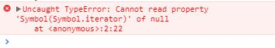
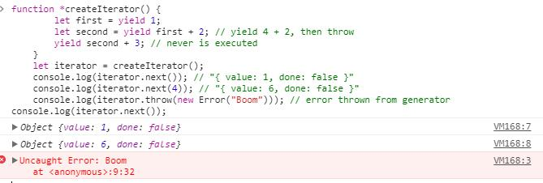
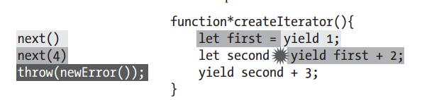

<h1>iterators-generators</h1>
<h2>iterators(迭代器)</h2>

迭代器是一种一种机制，它为各种不同数据结构提供统一的访问机制。如果该数据结构部署了Iterator接口那么该数据结构便可以完成遍历数据结构成员操作。

所有的迭代器都有一个next()方法，每次调用该方法后返回一个对象，该对象包含两个属性：value属性指的是当前成员的值，done属性是一个boolean值指的是遍历是否结束。当遍历结束后再次调用next()方法时，返回的对象value属性为undefined,done属性为true

以上述想法使用es5实现迭代器如下：

    function createIterator(items){
        var i = 0;
        return {
            next:function(){
                var done = (i >= items.length);
                var value = !done ? items[i++] :undefined;
                return {
                    value:value,
                    done:done
                }
            }
        }
    }

    var iterator = createIterator([1,2,3]);
    console.log(iterator.next()); // "{value:1,done:false}"
    console.log(iterator.next()); // "{value:2,done:false}"
    console.log(iterator.next()); // "{value:3,done:false}"
    console.log(iterator.next()); // "{value:undefined,done:true}"
    console.log(iterator.next()); // "{value:undefined,done:true}"

遵循上述规则上述代码书写迭代器似乎有些麻烦，es6提供generators帮助方便的生成迭代器。

<h2>generators</h2>
<h3>基础</h3>
generators 是一个返回迭代器的函数，与不同函数不同的是声明generators函数要在function后面添加"*",同时函数内部使用es6新增加的关键字yield来控制next()方法的返回值。

    // generator 函数
    function *createIterator(){
        yield 1;
        yield 2;
        yield 3;
    }

    // 创建迭代器
    let iterator = createIterator();
    console.log(iterator.next().value); // 1
    console.log(iterator.next().value); // 2
    console.log(iterator.next().value); // 3
    console.log(iterator.next().value); // undefined

从上述代码可以看出每次的yield使用都可以阻止代码的执行，当迭代器调用next()方法后才会继续执行。

可以使用函数表达式的方式创建generator,代码如下

    // es6 generator 实现数组遍历
    let createIterator = function *(items){
        for(let i=0;i<items.length;i++){
            yield items[i];
        }
    }
    let iterator = createIterator([1,2,3]);
    console.log(iterator.next()); // "{value:1,done:false}"
    console.log(iterator.next()); // "{value:2,done:false}"
    console.log(iterator.next()); // "{value:3,done:false}"
    console.log(iterator.next()); // "{value:undefined,done:true}"
    console.log(iterator.next()); // "{value:undefined,done:true}"

<strong>ps：只能在generators 内部使用yield,否则会出现报错。</strong>

    function *createIterator(items){
        items.forEach(function(item){
            yield item + 1;
        })
    }

    let iterator = createIterator([1,2,3]);
    console.log(iterator.next()); // "Uncaught SyntaxError: Unexpected identifier"

<h3>在对象中使用generator</h3>

    // es5
    let o = {
        createIterator:function *(items){
            for(let i=0;i<items.length;i++){
                yield items[i];
            }
        }
    }

    // es6
    let o = {
        *createIterator(items){
            for(let i=0;i<items.length;i++){
                yield items[i];
            }
        }
    }

ps：使用方式与函数相似，略有不同的是function 添加 "*"

<h3>Iterables（可迭代的）接口与for of </h3>
Iterator 接口的目的，就是为所有数据结构，提供了一种统一的访问机制，即当该数据结构存在Iterator 接口，即表示该数据结构是Iterables（可迭代的），即可以使用for of循环，当使用 for of循环循环遍历数据结构时，该循环会自动寻找该数据结构的Iterator 接口。 
Symbol.iterator本身是一个函数，即当前对象的默认的遍历器生成函数，也就是generator。 
在es6中集合对象 Array、Set、Map 与 String都是可迭代的，因此它们都有一个默认的迭代器，都可以使用for of 循环遍历。 
for of 循环使用时实际上先通过Symbol.iterator获取一个迭代器，在每次循环时都会调用迭代器的next方法并返回数据结构的成员值。 

    let values = [1,2,3];
    for (let num of values){
        console.log(num);
    }

ps:如果for of应用在没有Symbol.iterator接口的数据结构上将会抛错。

    var values = null;
    for(let value of values){
        console.log(value);
    }

<h4>默认的Iterator</h4>

    let values = [1,2,3];
    let iterator = values[Symbol.iterator]();
    console.log(iterator.next()); // "{value:1,done:false}"
    console.log(iterator.next()); // "{value:2,done:false}"
    console.log(iterator.next()); // "{value:3,done:false}"
    console.log(iterator.next()); // "{value:undefined,done:true}"

<h4>判断当前数据结构是否可迭代</h4>

    function isIterable(object){
        return typeof object[Symbol.iterator] === 'function';
    }
    console.log(isIterable([1,2,3])); //true
    console.log(isIterable('Hello')); //true
    console.log(isIterable(new Map()));//true
    console.log(isIterable(new Set())); //true
    console.log(isIterable(new WeakMap())); //false
    console.log(isIterable(new WeakSet())); //false

<h4>基于对象创建迭代器</h4>

    let collection = {
        items:[],
        *[Symbol.iterator](){
            for(let item of this.items){
                yield item;
            }
        }
    }

    collection.items.push(1);
    collection.items.push(2);
    collection.items.push(3);

    for(let x of collection){
        console.log(x);
    }

定义的对象默认是不可以迭代的，可以通过为对象添加属性名为Symbol.iterator的generator。使用这个方式可以用for of 遍历该对象。

<h2>内置的迭代器</h2>
<h3>keys、values、entries</h3>
es6为arrays、maps、sets提供内置的返回迭代器的方法。
<ol>
    <li>keys()：返回键名的遍历器</li>
    <li>values()：返回键值的遍历器</li>
    <li>entries()：返回键值对的遍历器</li>
</ol>

    // entries
    let colors = ['red','green','blue'];
    let tracking = new Set([1234,5678,9012]);
    let data = new Map();
    data.set('title','Understanding ECMAScript 6');
    data.set('format','ebook');

    for(let entry of colors.entries()){
        console.log(entry);
    }
    // [0, "red"]
    // [1, "green"]
    // [2, "blue"]
    for(let entry of tracking.entries()){
        console.log(entry);
    }
    // [1234, 1234]
    // [5678, 5678]
    // [5678, 5678]
    for(let entry of data.entries()){
        console.log(entry);
    }
    // ["title", "Understanding ECMAScript 6"]
    // ["format", "ebook"]

    // ps:很少有浏览器实现 Array.prototype.values()
    for(let entry of colors.values()){
        console.log(entry);
    }
    // "red"
    // "green"
    // "blue"
    for(let entry of tracking.values()){
        console.log(entry);
    }
    // 1234
    // 5678
    // 5678
    for(let entry of data.values()){
        console.log(entry);
    }
    // "Understanding ECMAScript 6"
    // "ebook"

    for(let entry of colors.keys()){
        console.log(entry);
    }
    // 0
    // 1
    // 2
    for(let entry of tracking.keys()){
        console.log(entry);
    }
    // 1234
    // 5678
    // 5678
    for(let entry of data.keys()){
        console.log(entry);
    }
    // "title"
    // "format"

<h3>arrays、maps、sets默认的迭代器</h3>
如果使用for of 遍历arrays、sets，其默认调用values() 方法返回迭代器,但maps则是默认调用entries()方法。

    // == colors.values()
    for(let value of colors){
        console.log(value);
    }
    // "red"
    // "green"
    // "blue"

    // == tracking.values()
    for(let num of tracking){
        console.log(num);
    }
    // 1234
    // 5678
    // 5678

    // == data.entries()
    for(let entry of data){
        console.log(entry);
    }
    // ["title", "Understanding ECMAScript 6"]
    // ["format", "ebook"]

<h3>解构与for of</h3>

    // == data.entries()
    for(let [key,value] of data){
        console.log(key + ':' + value);
    }
<h3>字符串的迭代器</h3>
ES6的目标是对Unicode全面支持，字符串的内置迭代器也是基于此目标的尝试。

    // es5
    var message = 'A 𠮷 B';
    for(let i=0;i<message.length;i++){
        console.log(message[i]);
    }
    // A
    // ""
    // �
    // �
    // ""
    // B

    // es6 for of
    var message = 'A 𠮷 B';
    for(str of message){
        console.log(str);
    }
    // A
    // ""
    // ""
    // B

<h3>NodeList Iterators</h3>

    var divs = document.getElementsByTagName('div');
    for(let div of divs){
        console.log(div.id);
    }
<h2>迭代器的高级用法</h2>
<h3>向迭代器传递参数</h3>
通过next() 方法想迭代器传递参数，参数变成了迭代器所对应的当前yield的变量。

    function *createIterator(){
        let first = yield 1;
        let second = yield first + 2;
        yield second + 3;
    }

    let iterator = createIterator();
    console.log(iterator.next()); // "{ value: 1, done: false }"
    console.log(iterator.next(4)); // "{ value: 6, done: false }"
    console.log(iterator.next(5)); // "{ value: 6, done: false }"
    console.log(iterator.next()); // "{ value: undefined, done: true }"
<h3>在迭代器内抛错</h3>

    function *createIterator() {
        let first = yield 1;
        let second = yield first + 2; // yield 4 + 2, then throw
        yield second + 3; // never is executed
    }
    let iterator = createIterator();
    console.log(iterator.next()); // "{ value: 1, done: false }"
    console.log(iterator.next(4)); // "{ value: 6, done: false }"
    console.log(iterator.throw(new Error("Boom"))); // error thrown from generator

 >

从第二张图可以看出 当执行 throw时 second变量还未生成，最后一个yield永远都不会被执行。可以在generator内添加try catch操作进行异常处理。

    function *createIterator() {
        let first = yield 1;
        let second;
        try {
            second = yield first + 2; // yield 4 + 2, then throw
        } catch (ex) {
            second = 7; // on error, assign a different value
        }
        yield second + 3;
    }
    let iterator = createIterator();
    console.log(iterator.next()); // "{ value: 1, done: false }"
    console.log(iterator.next(4)); // "{ value: 6, done: false }"
    console.log(iterator.throw(new Error("Boom"))); // "{ value: 10, done: false }"
    console.log(iterator.next()); // "{ value: undefined, done: true }"

<h3>在迭代器内return</h3>
generators其实是函数，在generators内部执行return语句意味着所有的遍历已经执行完成，再次执行next()方法将返回 {value:undefined,done:true}。

    function *createIterator(){
        yield 1;
        return;
        yield 2;
        yield 3;
    }
    let iterator = createIterator();
    console.log(iterator.next()); // "{ value: 1, done: false }"
    console.log(iterator.next()); // "{ value: undefined, done: true }"

如果generator中return语句后面存在value，那么当前调用的next()方法中将返回 {value:value,done:true}

    function *createIterator() {
        yield 1;
        return 42;
    }
    let iterator = createIterator();
    console.log(iterator.next()); // "{ value: 1, done: false }"
    console.log(iterator.next()); // "{ value: 42, done: true }"
    console.log(iterator.next()); // "{ value: undefined, done: true }"

<h3>generator的代理</h3>
在一个generator函数内通过使用yield关键字，并在其他generator函数名前添加'*',可以对被添加'*'的generator函数进行代理。

    function *createNumberIterator(){
        yield 1;
        yield 2;
    }
    function *createColorIterator(){
        yield 'red';
        yield 'green';
    }
    function *createCombinedIterator(){
        yield *createNumberIterator();
        yield *createColorIterator();
        yield true;
    }
    let iterator = createCombinedIterator();
    console.log(iterator.next()); // "{ value: 1, done: false }"
    console.log(iterator.next()); // "{ value: 2, done: false }"
    console.log(iterator.next()); // "{ value: "red", done: false }"
    console.log(iterator.next()); // "{ value: "green", done: false }"
    console.log(iterator.next()); // "{ value: true, done: false }"
    console.log(iterator.next()); // "{ value: undefined, done: true }"

通过结合使用上一个generator函数的return value，可以进行一些复杂的任务

    function *createNumberIterator(){
        yield 1;
        yield 2;
        return 3;
    }

    function *createRepeatingIterator(count){
        for(let i=0;i<count;i++){
            yield 'repeat';
        }
    }

    function *createCombinedIterator(){
        let result = yield *createNumberIterator();
        yield *createRepeatingIterator(result);
    }

    let iterator = createCombinedIterator();

    console.log(iterator.next()); // "{ value: 1, done: false }"
    console.log(iterator.next()); // "{ value: 2, done: false }"
    console.log(iterator.next()); // "{ value: "repeat", done: false }"
    console.log(iterator.next()); // "{ value: "repeat", done: false }"
    console.log(iterator.next()); // "{ value: "repeat", done: false }"
    console.log(iterator.next()); // "{ value: undefined, done: true }"

